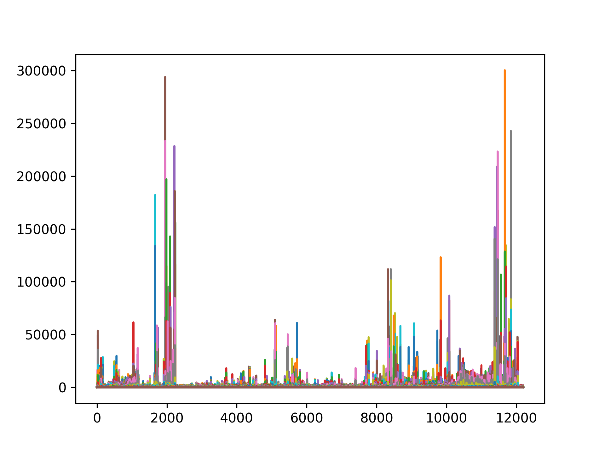
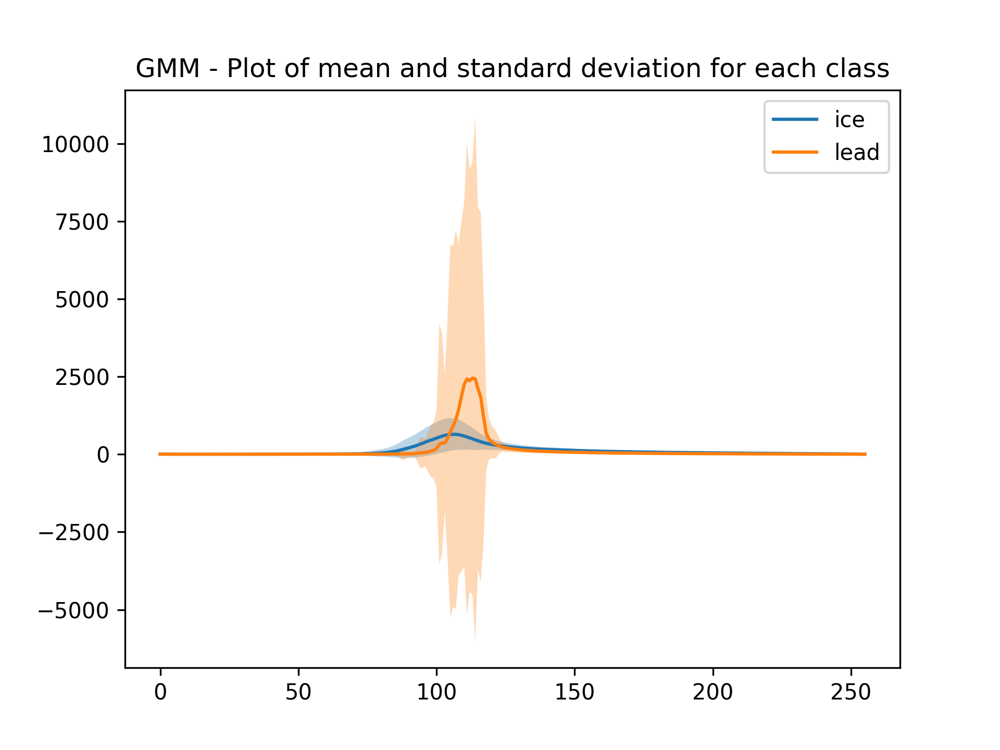
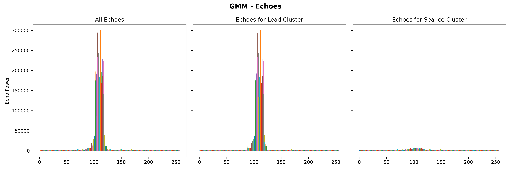
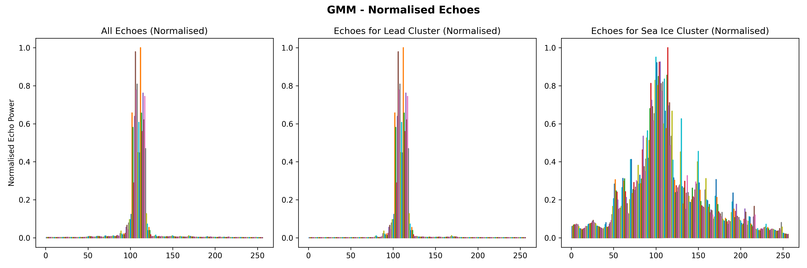
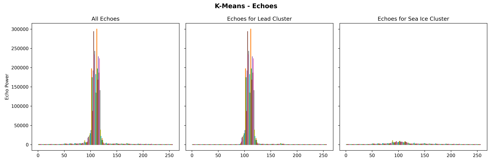
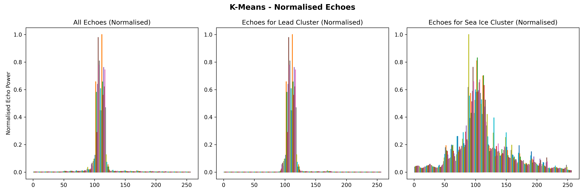
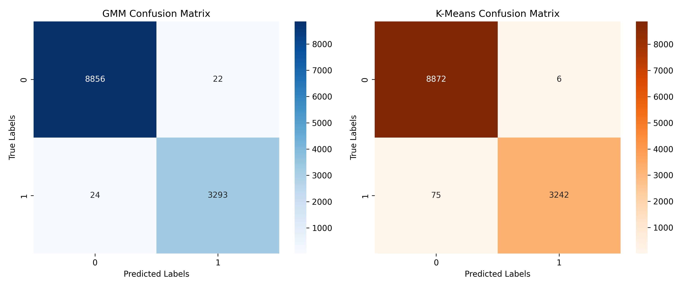

<p align="center">
  
</p>

# Project Context

This section covers unsupervised learning with a practical focus, avoiding deep theoretical discussions. The emphasis is on applying these methods in EO scenarios, particularly for classification tasks, where they excel at identifying patterns in unlabeled data.

Key topics:

* Detecting structure and relationships in datasets without predefined categories.
* Primary tasks:
  * Classifying sea ice and leads using Sentinel-2 optical data.
  *  Classifying sea ice and leads using Sentinel-3 altimetry data.

# Methods used

## K-means Clustering

K-means is an unsupervised learning algorithm used to partition data into k predefined clusters based on feature similarity. It works by iteratively assigning data points to the nearest centroid and updating centroids until minimal variation within clusters is achieved.

### Why K-means?

* Suitable for datasets with unknown structure (ideal for exploratory analysis).
* Simple and scalable for large datasets.

### Key Components:

* Choosing k: The number of clusters must be predefined.
* Centroid Initialization: Initial placement affects results.
* Assignment Step: Data points assigned to nearest centroid (using Euclidean distance).
* Update Step: Centroids recalculated based on assigned points.

## Gaussian Mixture Models (GMM)

GMM is a probabilistic model that represents data as a mixture of multiple Gaussian distributions, each with its own mean and variance. It is used for clustering and density estimation, offering a more flexible alternative to K-means.

### Why GMM for Clustering?

* Soft Clustering: Assigns probabilities to data points for each cluster rather than hard assignments.
* Flexible Cluster Shapes: Allows clusters to have different sizes and orientations, adapting to complex data distributions.

### Key Components:

* Number of Components: Similar to k in K-means, defines the number of Gaussian distributions.
* Expectation-Maximization (EM) Algorithm: Iteratively refines cluster assignments and model parameters.
* Covariance Type: Defines cluster shape (e.g., spherical, elliptical).

### The EM Algorithm:

* Expectation Step (E-step): Computes the probability of each point belonging to each cluster.
* Maximization Step (M-step): Updates Gaussian parameters (mean, covariance, mixing coefficient) to maximize data likelihood.
* Repeats until convergence.

# Getting Started

This project is designed to run seamlessly on Google Colab, a cloud-based platform that provides free access to GPUs and a pre-configured Python environment. Using Colab for AI in Earth Observation is particularly advantageous as it enables scalable processing of large satellite datasets, seamless integration with geospatial and machine learning libraries (TensorFlow, PyTorch, Rasterio, GeoPandas), and interactive visualization with tools like Folium and Matplotlib. Colab’s cloud-based environment removes the need for complex local setup, allowing users to quickly develop, train, and deploy AI models for remote sensing, land cover classification, and other geospatial analyses. Simply open the notebook available in this repo, connect to a runtime, and start using AI for Earth observation!

## Installation

These are the required packages for this project.

```python
!pip install rasterio
!pip install netCDF4
```

## Files

Here are the Sentinel-2 and Sentinel-3 data folders used in this project. These folders were generated by colocating Sentinel-3 and Sentinel-2 data from Copernicus Data Space, following the steps outlined in the Data Fetching and Colocating Sentinel-3 OLCI and Sentinel-2 Optical Data pages. Due to their large size, the folders are not included in this repository.

* Sentinel-2 optical data: S2A_MSIL1C_20190301T235611_N0207_R116_T01WCU_20190302T014622.SAFE-20240226T224735Z-001

* Sentinel-3 OLCI data: S3B_SR_2_LAN_SI_20190301T231304_20190301T233006_20230405T162425_1021_022_301____LN3_R_NT_005.SEN3-20240226T224839Z-001

# Results

Altimetry-Based Classification
In this example, Sentinel-3 altimetry data was used to distinguish between sea ice and leads. Since the waveform of backscattered echoes varies based on surface type, the distinct change in surface properties at leads enables their detection using characteristics such as peakiness and stack standard deviation

## GMM Implementation
Following the approach used in image classification, two components were defined for the Gaussian Mixture Model (GMM). The GMM then classified sea ice and leads into two clusters. The mean and standard deviation of these clusters before alignment are presented below.

<p align="center">
  
</p>

The altimetry dataset's echoes and their classifications are shown below, including both true and normalized waveforms: (a) all echoes from the dataset, (b) echoes identified as leads, and (c) echoes identified as sea ice.

<p align="center">
  
</p>

<p align="center">
  
</p>


## K-Means Implementation
Following the approach used in image classification, two clusters were defined for K-Means clustering. The algorithm then classified sea ice and leads into these two clusters. The mean and standard deviation of the clusters before alignment are presented below.

<p align="center">
  
</p>

The altimetry dataset's echoes and their classifications are shown below, including both true and normalized waveforms: (a) all echoes from the dataset, (b) echoes identified as leads, and (c) echoes identified as sea ice.

<p align="center">
  
</p>

<p align="center">
  
</p>

## Confusion Matrix

In the ESA dataset, sea ice = 1 and lead = 2. Therefore, we need to subtract 1 from it so our predicted labels are comparable with the official product labels.

<p align="center">
  
</p>

# Contact

Sebastien Schille - sebastien.j.schille@gmail.com

Project link - https://github.com/SebastienSchille/AI-for-EO-Week-4

# Acknowledgments

This code was created for the taught module GEOL0069 at UCL - ran by Dr. Michel Tsamados


